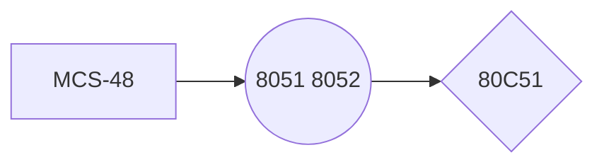

> Written with [StackEdit](https://stackedit.io/).  
# 绪论  
1.  单片机的概念    
    -   CPU、RAM、ROM、中断系统、定时器/计数器、串行口、I/O        
    -   不仅指单片计算机，还有微计算机、微处理器、微控制器等。
        
2.  发展  

3. 应用  
家用电器、办公自动化、工业自动化、智能仪器、汽车电子
4. 发展趋势
	-  多功能
	-  高性能
	-  全盘CMOS化趋势、推行串行扩展总线
# 80C51的基本结构
## 内部结构
1. 功能单元控制与之前的不同之处：利用SFR进行集中控制。
2. 部件
	- CPU
	- 程序存储器ROM
	- 数据存储器RAM
	- 并行I/O：数据、地址、控制总线
	- 串行I/O：全双工
	- 定时器/计数器：2个16位
	- 中断系统：5个中断源，2个中断优先级
	- 定时电路及元件
## 引脚
按照功能分：
1. 电源和晶振
	- V~CC~, V~SS~（地）
	- XATL1：输入到内部振荡器的反向放大器，外部时钟信号时，连接外部信号。
	- XATL2：反向放大器的输出，输入到内部时钟发生器。采用外部振荡时，连接振荡信号。
.  I/O
3. 控制线
	- RST: 复位，2T的1
	- $\overline{\text{EA}}$：片外程序存储器访问允许信号
	- ALE/PROG：地址锁存允许信号，输出。锁存低8位，输出1/6振荡频率的脉冲。
	- $\overline{\text{PSEN}}$：片外程序存储器 读选通 信号。数据被送上P0。
## CPU的结构和特点
控制器+运算器+工作寄存器+时序电路
1. 中央控制器
功能：控制指令读出、译码、执行，对指令执行过程进行定时控制，决定是否分支转移
	- 程序计数器PC
	16位-64KB, 不属于SFR
	存放下一条指令的地址
		- 自动+1
		- 转移时，置入目的地址
		- 调用或中断，置入子程序入口地址或中断矢量
	- 数据指针DPTR
**与PC的异同**：
16位。作地址寄存器时，都通过P0、P2输出
PC不可访问，不属于SFR. DPTR位于SFR中
	- 指令寄存器IR、指令译码器及控制逻辑
2. 运算器
	- ALU ACC By
	A积的高8位，被除数，商
	B积的低8位，除数，余数
	B也可作RAM的一个单元使用
	- 程序状态字PSW
	| CY | AC | F0 | RS1 | RS0 | OV | - | P |
	P OV AC CY根据ALU结果
	（1）P：奇偶标志位
	（2）OV：溢出。
	（3）AC：辅助进位 4低-高
    （4）CY：进位标志，最高位
    （5）F0：用户标志位
3. 时钟电路及CPU的工作时序
	- ALE：1/6振荡频率，长度1S
	- 1T = 6S状态 = 12 拍（振荡脉冲的周期）
## 存储器结构和地址空间
采用程序和数据分开存储的哈佛结构
1. 程序存储器
分为片内片外，通过$\overline{\text{EA}}$置1从片外的0001H开始
特定程序入口：
	- 复位 0000H
	- 外部中断0 0003H
	- 计时器T0溢出 000BH
	- 外部中断1 t0013H
	- T1 001BH
	- 串行口中断 0023H
2. 片内数据存储器
8位 256
- 片内数据存储器区0~127
32+16+80=127
00-1F（工作寄存区）+ 位寻址区（128）+ 字节寻址区
-  堆栈区及堆栈指示器SP
07H 保护现场和恢复现场
- SFR 128~255
（除工作寄存器和SP的所有寄存器）
可字节寻址和位寻址
3. pian'wai
<!--stackedit_data:
eyJoaXN0b3J5IjpbLTgxNzQyNjEwOCwxMzU3ODc1NDA5LC0xND
AxNjk5NTczLDYyOTY4MDQ4LC0xMzY0NzYyMzA2LC0yNTEyNTI5
ODEsMTM5ODM0NzM0Myw3Mzk0NTY3OTYsODkxNDc2MzMwXX0=
-->