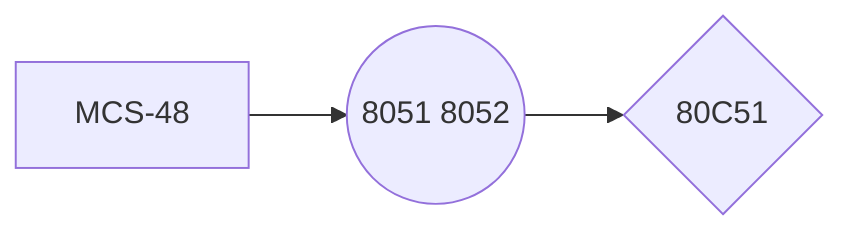

> Written with [StackEdit](https://stackedit.io/).  
# 绪论  
1.  单片机的概念    
    -   CPU、RAM、ROM、中断系统、定时器/计数器、串行口、I/O        
    -   不仅指单片计算机，还有微计算机、微处理器、微控制器等。
        
2.  发展  

3. 应用  
家用电器、办公自动化、工业自动化、智能仪器、汽车电子
4. 发展趋势
	-  多功能
	-  高性能
	-  全盘CMOS化趋势、推行串行扩展总线
# 80C51的基本结构
## 内部结构
1. 功能单元控制与之前的不同之处：利用SFR进行集中控制。
2. 部件
	- CPU
	- 程序存储器ROM
	- 数据存储器RAM
	- 并行I/O：数据、地址、控制总线
	- 串行I/O：全双工
	- 定时器/计数器：2个16位
	- 中断系统：5个中断源，2个中断优先级
	- 定时电路及元件
## 引脚
按照功能分：
1. 电源和晶振
	- V~CC~, V~SS~（地）
	- XATL1：输入到内部振荡器的反向放大器
	- XATL2：反向放大器的输出，输入到内部时钟发生器。采用外部振荡时，连接振荡信号。
.  I/O
3. 控制线
	- RST: 复位，2T的1
	- $\overline{\text{EA}}$：片外程序存储器访问允许信号
	- ALE/PROG：地址锁存允许信号，输出。锁存低8位，输出1/6振荡频率的脉冲。
	- $\overline{\text{PSEN}}$：片外程序存储器 读选通 信号。数据被送上P0。
## CPU的结构和特点

<!--stackedit_data:
eyJoaXN0b3J5IjpbMTU2OTMwMTY1MSwtODgyNDc4MzE1LDE4Mj
cyOTMxMDEsNzM5NDU2Nzk2LDQ3MTEyMjY5OSw4OTE0NzYzMzAs
MzczNjI4OTMxXX0=
-->