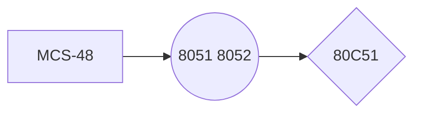

> Written with [StackEdit](https://stackedit.io/).  
# 绪论  
 1.  单片机的概念    
    -   CPU、RAM、ROM、中断系统、定时器/计数器、串行口、I/O        
    -   不仅指单片计算机，还有微计算机、微处理器、微控制器等。
        
 2.  发展  

 3. 应用  
家用电器、办公自动化、工业自动化、智能仪器、汽车电子
 4. 发展趋势
	-  多功能
	-  高性能
	-  全盘CMOS化趋势、推行串行扩展总线
# 80C51的基本结构
## 内部结构
. 功能单元控制与之前的不同之处：利用SFR进行集中控制。
. 部件
	- CPU
	- 程序存储器ROM
	- 数据存储器RAM
	- 并行I/O：数据、地址、控制总线
	- 串行I/O：全双工
	- 定时器/计数器：2个16位
	- 中断系统：5个中断源，2个中断优先级
	- 定时电路及元件
## 引脚
按照功能分：
. 电源和晶振
	- V~CC~, V~SS~（地）
	- XATL1：输入到内部振荡器的反向放大器，外部时钟信号时，连接外部信号。
	- XATL2：反向放大器的输出，输入到内部时钟发生器。采用外部振荡时，连接振荡信号。
.  I/O
. 控制线
	- RST: 复位，2T的1
	- $\overline{\text{EA}}$：***片外程序存储器访问允许信号***
	- ALE/PROG：地址锁存允许信号，输出。锁存低8位，输出1/6振荡频率的脉冲。
	- $\overline{\text{PSEN}}$：片外程序存储器 读选通 信号。数据被送上P0。
## CPU的结构和特点
控制器+运算器+工作寄存器+时序电路
. 中央控制器
功能：控制指令读出、译码、执行，对指令执行过程进行定时控制，决定是否分支转移
	- 程序计数器PC
	16位-64KB, 不属于SFR
	存放下一条指令的地址
		- 自动+1
		- 转移时，置入目的地址
		- 调用或中断，置入子程序入口地址或中断矢量
	- 数据指针DPTR
**与PC的异同**：
16位。作地址寄存器时，都通过P0、P2输出
PC不可访问，不属于SFR. DPTR位于SFR中
	- 指令寄存器IR、指令译码器及控制逻辑
. 运算器
	- ALU ACC By
	A积的高8位，被除数，商
	B积的低8位，除数，余数
	B也可作RAM的一个单元使用
	- 程序状态字PSW
	| CY | AC | F0 | RS1 | RS0 | OV | - | P |
	P OV AC CY根据ALU结果
	（1）P：奇偶标志位
	（2）OV：溢出。
	（3）AC：辅助进位 4低-高 3
    （4）CY：进位标志，最高位7
    （5）F0：用户标志位
. 时钟电路及CPU的工作时序
	- ALE：1/6振荡频率，长度1S
	- 1T = 6S状态 = 12 拍（振荡脉冲的周期）
## 存储器结构和地址空间
采用程序和数据分开存储的哈佛结构
 12. 程序存储器
分为片内片外，通过$\overline{\text{EA}}$置1从片外的0001H开始
特定程序入口：
	- 复位 0000H
	- 外部中断0 0003H
	- 计时器T0溢出 000BH
	- 外部中断1 t0013H
	- T1 001BH
	- 串行口中断 0023H
. 片内数据存储器
8位 256
 片内数据存储器区0~127
32+16+80=12
00-1F（工作寄存区）+ 位寻址区（128）+ 字节寻址区 + 堆栈区
  堆栈区及堆栈指示器SP（SFR中）
07H 保护现场和恢复现场
 SFR 128~255
（除工作寄存器和SP的所有寄存器）
可字节寻址和位寻址
. 片外数据存储器
只能间接寻址，可通过并行或串行总线扩展片外数据存储
DPTR R0 R1
## 并行输入输出口
|I/O|P0|P1|P2|
|-|-----------------|------|----|-------|
|性质|真正双向口 |准双向口|准双向口|准双向口|
|驱动能力          |8个TTL|4|4|4|
|替代功能|程序存储器、片外数据/地址低8||程序存储器、片外数据/地址高8|串行口、中断、片外数据存储|
 18. P0
 作I/O用，输入时先置1，用电阻上拉才有高电平输出，输入时为悬浮状态，高阻抗的输入口
 作地址/数据总线复用，此后不能作I/O用
. P1
 输入时设为输入状态，先输出1
 无高阻悬浮状态，不是输入就是输出态
 读引脚读锁存
 24. P2
	- 与P1口的区别：增加了一个多路开关
	- 地址线是8位一起自动输出的
	- 输出锁存
. P3
 26   RXD、TXD串行输入输出口
  $\overline{\text{INT0}}$，$\overline{\text{INT1}}$，外部中断的请求
  T0：定时器外部计数脉冲输入
  $\overline{\text{WR}}$，外部数据存储器或I/O写选通 
  $\overline{\text{RD}}$，外部数据存储器或I/O读选通 
## 布尔处理器功能部件
 31. 位累加器CY
 32. 位寻址的RAM
 33. 位寻址的I/O
 34. 位操作指令系统
## 工作方式
 .  复位
 PC初始化位0000H，复位期间个别引脚信号为无效状态
  上电自动复位
  按键电平复位
  外部脉冲复位
 复位后特殊功能寄存器转换到复位状态
 .  程序执行
  最基本的工作方式
 .  低功耗
 4. 待机
 PCON--IDL（.0）置1，中断功能存在，向CPU提供时钟的电路阻断，与CPU相关的寄存器被冻结（ACC, PSW, PC）
 可用中断或硬件复位退出待机
  掉电保护
 PCON.1 只能复位退出，只有内部RAM被保护。   
 43. 编程和校验 
# 80C51的指令系统
## 概述
. 寻址方式：寄存器、直接、寄存器间接、立即、变址、相对、位
## 数据传送类指令
不影响标志位
. 堆栈指令(SP) = 30H, (DPTR) = 0123H
```
PUSH   DPL
PUSH   DPH
```
执行结果(SP) = 32H, 'PUSH'(31H) = 23H, (32H) =01H
PUSH先+1，POP后－1
```
POP DPH ;((SP))-->DPH
POP DPL
```
# 编程
 1. MOV 内部8位数据传输指令
 MOVX 外部数据传输指令
MOVC 程序存储器传输指令（查表指令）
2. 汇编语言的种类：指令语句、伪指令语句、宏指令
3. 伪指令：ORG END EQU DL DB DW DS BIT 
4. 子程序
- 以RET结束，由CALL调用
- 调用子程序之前，将数据和参数送到共享存储区中
- 保护现场和恢复现场
# 中断系统原理及应用
## 概述
1. 概念
- 中断：程序执行过程中，允许外部或内部事件通过硬件打断程序执行，转向中断服务程序中，完成中断服务程序后，CPU继续原来被打断的程序
- 中断源：能产生中断的内外部事件
- 中断优先级
- 中断嵌套
2. 解决的问题
- CPU及时响应中断，中断服务处理后能回到原断点继续处理原先的任务。
- 多个中断源同时申请时，能响应优先级高的中断
- 低优先级中断源享用中断服务时，高优先级中断源申请中断，能转去执行高优先级中断源的服务程序，实现中断嵌套，并逐级正确返回原断点处。
3. 中断的主要功能
- 实现CPU与外部设备的速度配合
- 实现实时控制
- 实现故障的及时发现和处理
- 实现人机联系
## 中断系统

1. 中断源
2个外部中断和3个内部中断
- 外部中断
$\overline{\text{INT0}}$、$\overline{\text{INT1}}$
中断请求的方式：电平有效、跳变有效
- 定时中断: TF0、TF1
- 串行中断：每发送或接受一帧串行数据时，就产生一个中断请求。RXD、TXD
## 中断的控制
1. 中断标志
外部中断和定时器中断都在TCON寄存器内，串行口的中断标志放在SCON寄存器中
- IT0：$\overline{\text{INT0}}$的触发方式申请控制位
- TF1：T1计数器溢出，由硬件置位，**响应中断时由硬件复位**。
- IE1：外部中断1向CPU申请中断
- TI：串行口发送中断源，发送完一帧由硬件置位，**响应中断后必须用软件清0**。（RI串行口接收中断源）
- shi
<!--stackedit_data:
eyJoaXN0b3J5IjpbLTE3NjY1NzQwNDUsLTQzOTI3Mzg5MSwtMT
Q0Njg3OTQzOCw2ODI5MjA4OCwxMjk2NjkwODIsMzc5OTgzNDY3
LC02MjEzMDEyNTksLTExODMwNTUwODAsLTIwNzcwODc4OTQsMT
Q3NzQ0MTgwOCwtNjA5OTk0ODQ4LC0xMDIwNTczMzE4LDY0MDg3
OTUzMyw5MDEwNjMxNTcsLTk5MzY4MzEzMCwxNzk0Njk3ODUxLC
0xMzI5Mjg2MjkwLDYzMjg3OSwtMTcxNzE1MzY3MiwtMTE2MjE3
MTQ3M119
-->